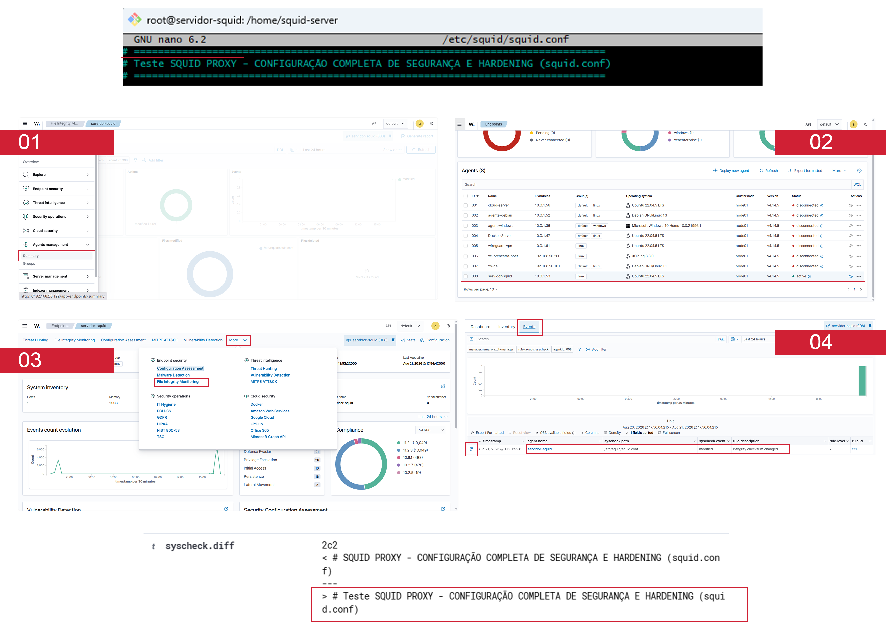

# Configuração:
```xml
<syscheck>
    <!-- Monitorizar um diretório completo -->
    <directories check_all="yes" report_changes="yes" whodata="yes" realtime="yes">/etc/squid/</directories>

    <!-- Monitorizar um ficheiro específico -->
    <directories check_all="yes" report_changes="yes" whodata="yes" realtime="yes">/etc/squid/nome_do_arquivo.extensao</directories>
</syscheck>
```

---

## Teste
1. Altere qualquer ficheiro dentro do diretório `/etc/squid/`.
2. Caso tenha configurado um ficheiro específico, realize a alteração diretamente nesse mesmo ficheiro.

---

## Validação
1. Aceda ao *dashboard* do seu servidor Wazuh.
2. Navegue até ao seu agente (servidor Squid).
3. Procure pelo módulo **"File Integrity Monitoring"** e aceda à secção **"Events"**.

---

## Imagens de Referência
